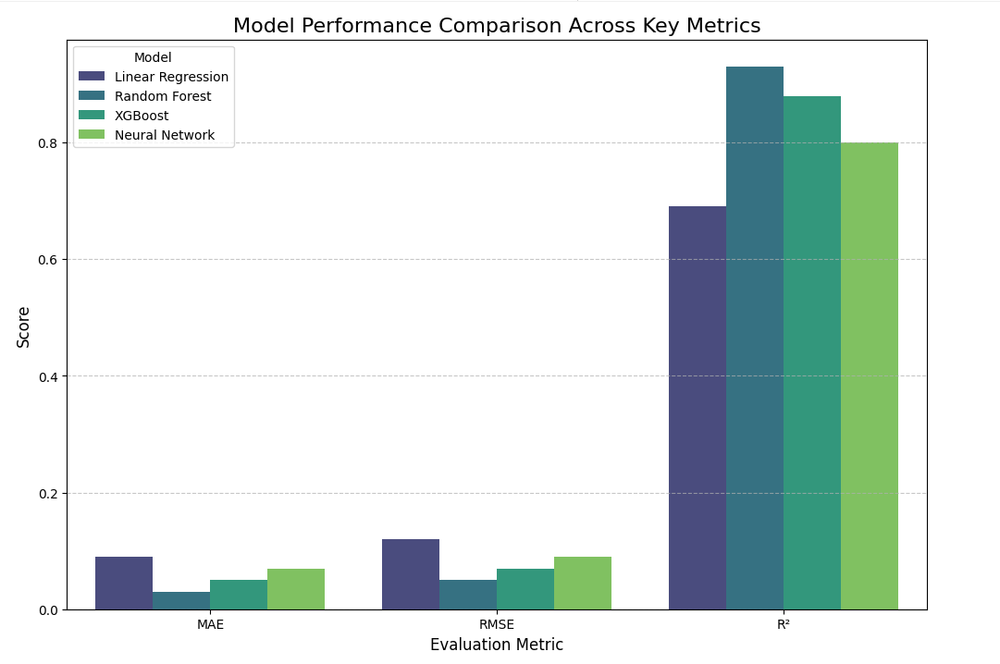

# 🌍 Predicting Global Poverty with Machine Learning

## 📌 Project Overview
This project applies machine learning to **predict a country’s Human Development Index (HDI)** — a key measure of health, education, and living standards.  
The work is motivated by the **United Nations’ Sustainable Development Goals (SDGs)** and the need for **evidence-based policymaking** in tackling global poverty.  

By forecasting HDI trends, the model can help governments and international agencies:
- Anticipate development challenges
- Test the impact of different policy decisions
- Allocate resources more effectively  

---

## 📊 Dataset
- **Source:** [World Bank World Development Indicators (WDI)](https://databank.worldbank.org/source/world-development-indicators)  
- **Coverage:** 200+ countries, 50+ years of data  
- **Size:** ~1,500 indicators (economic, health, education, environment, trade, etc.)  
- **Target Variable:** Human Development Index (HDI)  
- **Features:** Selected socio-economic and health indicators (GDP per capita, education expenditure, life expectancy, etc.)  

---

## 🛠️ Methods
1. **Data Preparation**
   - Handle missing values
   - Feature engineering (e.g., lag features for time series)
   - Normalization & scaling  

2. **Exploratory Data Analysis (EDA)**
   - Trends in HDI distribution
   - Correlations between indicators
   - Univariate & multivariate visualizations  

3. **Modeling**
   - Random Forest / XGBoost (classical ML approach)  
   - Neural Network (deep learning approach)  

4. **Evaluation Metrics**
   - MAE (Mean Absolute Error)  
   - RMSE (Root Mean Square Error)  
   - R² (explained variance)  

---

## 📈 Results
- Both models were tested and compared on performance and interpretability.  
- Random Forest provided interpretable insights into **which features matter most** (e.g., education spending, life expectancy).  
- Neural Networks captured more complex patterns but required careful tuning to avoid overfitting.  

---
 ## 🖼️ **Visuals:**
     * 
     * 
     * 
     * 

---
     
## 🌟 Impact
The project demonstrates how machine learning can be applied to:
- Provide **early-warning systems** for countries at risk of falling behind  
- Support **policy simulation** (e.g., effects of investing more in healthcare or education)  
- Contribute to **transparent, data-driven development planning**  

---

## 🚀 Usage
Clone the repo and open the notebook in Jupyter/Colab:

```bash
git clone https://github.com/your-username/poverty-ml-prediction.git
cd poverty-ml-prediction

 
